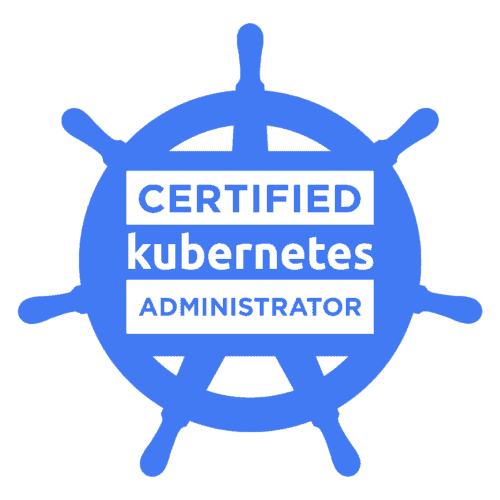

# Certified Kubernetes Associate (CKA) Study Guide  
This is my study guide for the Certified Kubernetes Associate (CKA) exam.  
https://www.cncf.io/certification/cka/  

<p align="center">
  
</p>
<br/>

**2Hrs | Cost $300 | [Online Exam](https://training.linuxfoundation.org/certification/certified-kubernetes-administrator-cka/)**  
**K8s version 1.20 (Jan 22, 2021)**
 
<br/>


## CKA Curriculum  

Updated exam curriculum for v1.20  
https://github.com/cncf/curriculum/

<br/>

**Domain**	| **Weight**
------- | -------------
[**1. Cluster Architecture, Installation & Configuration**](CKA-1-Cluster-Architecture-Installation.md)	| 25%  
1.1. Manage role based access control (RBAC)	|
1.2. Use Kubeadm to install a basic cluster	|
1.3. Manage a highly-available Kubernetes cluster	|
1.4. Provision underlying infrastructure to deploy a Kubernetes cluster	|
1.5. Perform a version upgrade on a Kubernetes cluster using Kubeadm	|
1.6. Implement etcd backup and restore |
[**2. Workloads & Scheduling**](CKA-2-Workloads-Scheduling.md)	| 15%  
2.1. Understand deployments and how to perform rolling update and rollbacks	 |
2.2. Use ConfigMaps and Secrets to configure applications	 |
2.3. Know how to scale applications	 |
2.4. Understand the primitives used to create robust, self-healing, application deployments	 |
2.5. Understand how resource limits can affect Pod scheduling	 |
2.6. Awareness of manifest management and common templating tools | 
[**3. Services & Networking**](CKA-3-Services-Networking.md)	| 20%
3.1. Understand host networking configuration on the cluster nodes	|
3.2. Understand connectivity between Pods	 |
3.3. Understand ClusterIP, NodePort, LoadBalancer service types and endpoints	 |
3.4. Know how to use Ingress controllers and Ingress resources	|
3.5. Know how to configure and use CoreDNS	|
3.6. Choose an appropriate container network interface plugin  |
[**4. Storage**](CKA-4-Storage.md)	| 10%
4.1. Understand storage classes, persistent volumes	 |
4.2. Understand volume mode, access modes and reclaim policies for volumes	|
4.3. Understand persistent volume claims primitive	|
4.4 Know how to configure applications with persistent storage  |
[**5. Troubleshooting**](CKA-5-Troubleshooting.md) |	30%
5.1. Evaluate cluster and node logging	|
5.2. Understand how to monitor applications	 |
5.3. Manage container stdout & stderr logs	|
5.4. Troubleshoot application failure	 |
5.5. Troubleshoot cluster component failure	 |
5.6 Troubleshoot networking  |

<br/>


## Kubernetes Documentation
- Main Documentation page:  
https://kubernetes.io/docs/  
  
- Cheat Sheet:  
https://kubernetes.io/docs/reference/kubectl/cheatsheet/  

- `kubectl` Command Reference
https://kubernetes.io/docs/reference/generated/kubectl/kubectl-commands  
  
- One-page API Reference for Kubernetes v1.20  
https://kubernetes.io/docs/reference/generated/kubernetes-api/v1.20/  
  

<br/>

## CKA Training  
- Great course from "a Cloud Guru":  
https://learn.acloud.guru/course/certified-kubernetes-administrator/  
by William Boyd
<br/>

## CKA Lab Exercises

### [My CKA Lab Exercises](CKA-Lab-Exercises.md)  
https://github.com/tplisson/k8s-CKA-study-guide/blob/main/CKA-Lab-Exercises.md  


### Other CKA Lab Exercises  
- killer.sh_ 
  https://killer.sh/cka
  - not free but worth it
  - 29.99€ for 2 CKA sessions of the same mock exam  
  
- Chad M. Crowell  
https://github.com/chadmcrowell/CKA-Exercises

- Ashutosh  
https://github.com/ashutoshvct/k8s/tree/master/cka-exam

- David-VTUK  
https://github.com/David-VTUK/CKA-StudyGuide/

- stretchcloud  
https://github.com/stretchcloud/cka-lab-practice

<br/>


## CKA Exam Tips
- **Time management is key!**
  - You have 15-20 performance-based tasks to perform in 2 hours, so an average of 6-8 min per task. Some tasks are easy but some others will take much more time.
  - Get all questions done: 
    - Make sure to go through all 15-20 tasks
    - Get all the easiest tasks done first!
  - Never get stuck: 
    - If a task is seems difficult or it's taking you more than 2-3 min, then flag it and keep moving to get any easy task done first. 
    - Then go back to each of the flagged tasks afterwards.
<br/>

- Setup kubectl autocomplete 
  - ```source <(kubectl completion bash)```
  - ```alias k=kubectl```
  - ```complete -F __start_kubectl k```
<br/>  

- Setup an shell variable to easily generate resource specs in YAML format:
  - ```export do="--dry-run=client -o yaml"```
    - then we can run: 
    - ```k run pod1 --image=nginx $do```
<br/>  

- Setup VIM for yaml by adding these lines to the `~/.vimrc` configuration file:
  - ```set et``` or ```set expandtab``` (spaces instead of tabs)
  - ```set si``` or ```set smartindent`` (automatic and smart indentation)
  - ```set ts=2``` or ```set tabstop=2``` (the number of spaces that a tab equates to)
  - ```set sts=2``` or ```set softtabstop=2``` (the number of spaces to use when expanding tabs)
  - ```set sw=2``` or ```set shiftwidth=2``` (the number of spaces to use when indenting or de-indenting a line)

  ```
  # .vimrc
  set et
  set si
  set ts=2
  set sts=2
  set sw=2
  ```  

- Use `kubectl` [shortnames](https://kubernetes.io/docs/reference/kubectl/overview/#resource-types): 
  - `no` `po` `ns` `deploy` `svc` `ing` `ds` `netpol` `pv` `pvc` `sa` `cm` `ep` `sc` ...
<br/>

- Use [imperative commands](https://kubernetes.io/docs/reference/generated/kubectl/kubectl-commands#create) whenever possible:
  - E.g. use: `k run -h`, `k create deploy -h`, `k expose -h`...
  - instead of: `k apply -f <filename.yaml>`
<br/>  

- Use `kubectl explain` to [list the fields of supported API resources](https://kubernetes.io/docs/reference/generated/kubectl/kubectl-commands#explain)
<br/>

- Use `kubectl replace` to [replace an existing resource with some updated specs](https://kubernetes.io/docs/reference/generated/kubectl/kubectl-commands#replace):
  - This saves you time compared to using `k delete` and `k apply -f <filename>`
<br/>

- Use `-w` (i.e. `--watch=true`) to  start watching updates to a particular object.
  - `k get po -w` to watch your pods
<br/>